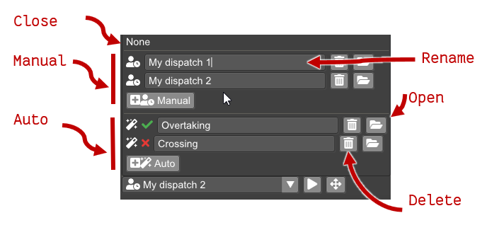
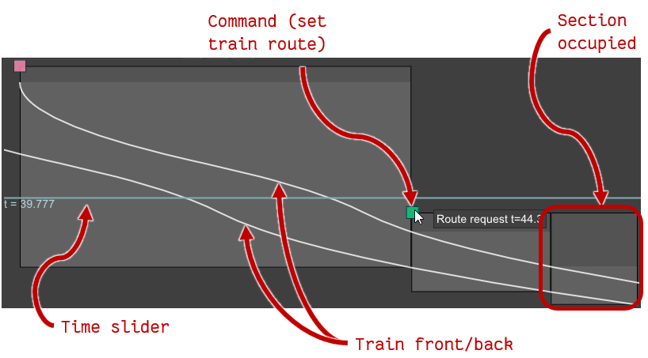

From the infrastructure view, you can start dispatching trains by either:

 1. Right-clicking a boundary node and starting a train from there. If no dispatch is 
    currectly selected in the dispatch selection menu, a new dispatch will be created.
 2. Opening the dispatch selection menu and adding a new dispatch.

The dispatch selection menu is used to open or close the dispatch view, to 
switch to another dispatch or to add, delete or rename dispatches.

## Dispatch selection

The dispatch selection menu is always located at the bottom of the infrastructure
view. 

The dispatch selection menu presents the dispatching **modes**:

* **None**: closes the dispatch view, leaving only the infrastructure.
* **Manual dispatches**: dispatches where you can add and remove commands.

  Commands are either:

    * **Trains**: a train of a given vehicle type appears in the model
      through a specified boundary traintrain  route.

    * **Route**: a train route is activated.

* **Auto dispatch**: plan dispatched by giving constraints for train movements,
  and see a list of possible dispatches for the plan on the current infrastructure. 
  See [Planning](planning.md).

The dispatch selection menu has buttons for adding new dispatches of each mode,
renaming, deleting, and opening them. Opening a dispatch opens the 
dispatch diagram and planning view (if an auto dispatch is selected).
Each auto dispatch also has an icon showing whether it is currently 
satisfied or not on the current infrastructure.

## Dispatch diagram view

When a dispatch has been opened in the dispatch selection menu, 
a diagram is shown at the bottom part of the window. 
The diagram is a time/distance diagram with 
time on the vertical axis and distance (mileage) on
the horizontal axis.
The diagram contains:

 * Squares representing the commands in the dispatch. Right-clicking
   a command brings up a context menu where the command can be deleted.
   Left-clicking and dragging the command adjusts the time
   that the command is given. 

 * Boxes representing the train vacancy detection status of each section.

 * Curves representing the front and the back of each train.

### Interaction in the dispatch view

Left-clicking the diagram view will set the time slider to the time corresponding
to the vertical position of the cursor.

If the currently opened dispatch is a manual dispatch, the dispatch
can be edited.

New commands are added to the dispatch from the infrastructure context menu 
(see [Infrastructure](infrastructure.md)).

