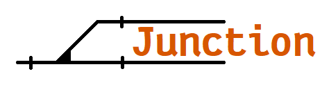
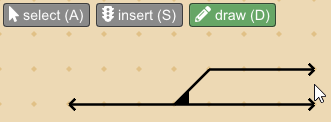
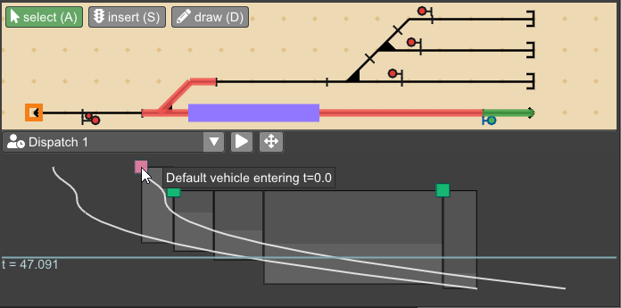
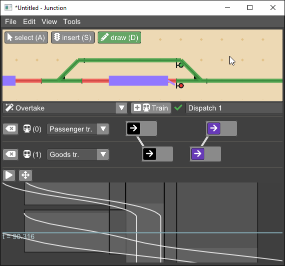

[⇓ Download (Win/Linux/MacOS)](https://github.com/luteberget/junction/releases/latest){: .btn .btn-green } [Repository](http://github.com/luteberget/junction/){: .btn .btn-outline }

Junction is a railway operations analysis tool for small-scale infrastructure,
such as construction projects. 
It focuses on quickly building or importing infrastruture models, and 
then letting you dispatch trains to examine capacity properties of the 
track layout and signaling equipment.
You can manage several dispatch scenarios and see how their timelines change when you make
changes to the infrastructure.
Junction also features an auto-dispatch mode, where you supply a high-level
description of operations, and the program works out the required dispatch commands
needed to execute the operations, resulting in a set of test cases for 
your signaling design that help you when making changes as your project progresses.

## Quick tour

 * Quickly build the **infrastructure** of tracks and signaling equipment by 
   drawing lines on a grid. Switches and crossings are automatically identified 
   and displayed based on the lines.

   See [Infrastructure](infrastructure.md).

    

 * **Dispatch** individual trains using train routes by pointing to the starting location
   of a train route and selecting a route from the menu.

   See [Dispatching](dispatch.md).

   

 * Build **plans** representing train operations such as crossing, overtaking, train frequency, etc.,
   and get a list of possible dispatch patterns that solve.
   When you continue adjusting the infrastructure, the plans will be updated and
   you can check at a glance that operations are still working.

   See [Planning](planning.md).

   

