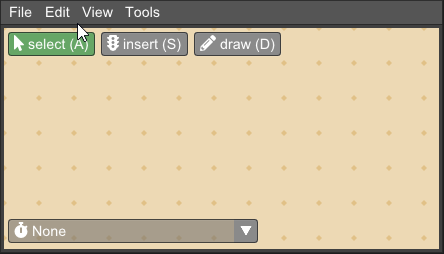
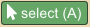
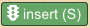
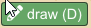
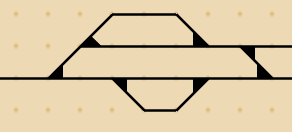
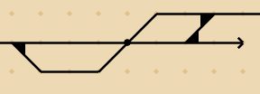
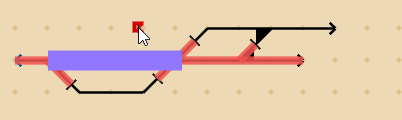

The top part of the Junction main window shows the infrastructure, consisting of tracks, track nodes, and 
signalling objects. When Junction is first started, or a new document is created, the infrastructure
is empty and the window shows only a blank canvas and buttons for each editing tool.

### Infrastructure editing tools

The top tool bar has the following tools:

 *  Select items (hotkey 'A'). 

    Left-click on tracks, nodes, or objects to select them. Currently selected items 
    are highlighted by color. Hold the Shift button to add to selection instead of replacing.
    Left-click and drag while the pointer is not over any item to draw a selection window. When
    releasing the mouse button, all items side the selection window will be selected.
    Left-click and drag while the pointer is over an item to move the item. If the
    item is part of the current selection, all currently selected items will be moved.

 *  Insert object (hotkey 'S').

    Insert railway signalling objects. The available objects are:

      * Main signal (with or without distant signal)
      * Detector (train vacancy detection section boundary)

    When inserting a main signal, click on a location beside a track to insert the 
    signal at that side of the track. The side of the track determines the travel direction 
    the signal faces. Trains see signals on the right-hand side of the track.

    Detectors are placed in the middle of the track, and constitute a section boundary 
    for a train vacancy detection section.

 *  Draw tracks (hotkey 'D').

    Left-click and drag to draw lines representing tracks onto the infrastructure grid. 
    Whenever more than two lines meet at a grid point, a node type is detected and a node 
    symbol is displayed. Three lines meeting will produce a switch, and four lines
    meeting will produce a crossing. Examples:

     

The bottom tool bar contains the closed version of the dispatch select menu. Click the tool bar
to open the dispatch select menu. See [Dispatch](dispatch.md).

When a dispatch is opened, the current state of the infrastructure at the time selected in the
diagram view (see [Dispatch](dispatch.md)) is shown by graphics overlaid on the 
infrastructure view. These graphics show e.g. train positions and detection section 
status, but do not affect the use of the infrastructure editor. You may
still edit the infrastructure while the dispatch state is shown, and the state will be 
updated accordingly.

### Context menu

The context menu is opened by right-clicking on the infrastructure view. 
If the pointer is currently over an item, the selection will be set to that item before opening
the context menu.
The context menu contains actions that are relevant to the currently selected items:

 * Delete, works for all items. When deleting a node, only the changes from the default
   detected node are deleted, as the number of lines meeting at a grid point will still 
   determine the node type.

 * On nodes and objects, the available properties of that node or object type are displayed
   in the context menu. For example, crossings may have type (a) crossovers (no switching), (b) single slip
   (switching in one direction) or (c) double slip (switching in both directions).
   Main signals may have distant signals enabled or disabled.

 * On boundary nodes and main signals, available train routes are shown. 
   If a train route is selected, it is added to the current active dispatch at
   the current time. If no dispatch is active, a new dispatch will be created and opened, 
   and the selected train route will be added to it. See [Dispatch](dispatch.md).

 * On all items, adding the item as a visit location in the currently active plan is shown.
   If no plan is currently active, a new plan is opened, a new train is added to it, and the
   visit location is added to the train. See [Planning](planning.md).

