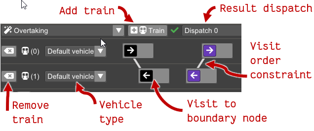

Whenever an **auto dispatch** is selected in the dispatch selection menu (see [Dispatch](dispatch.md)),
the planning menu is opened.

The planning view lets you edit the plan and view all the alternative dispatches
that satisfy the constraints.

 * **Add trains** button adds a new row to the bottom of the planning area,
    representing a new train with no locations it must visit.
    Visits can be added to the train by right-clicking in the
    infrastructure view and using the context menu to add a visit to that location
    to a train.

  * **Result dispatch** menu shows whether any dispatches were found,
  showing a green checkmark for success or a red cross for fail.
  Selecting a dispatch from the menu brings up the diagram view which
  is used in the same way as the diagram for the manual dispatch, except
  that the commands can not be edited.

  * **Trains** are shown one in each row of the planning view. Trains
  can be removed and their vehicle type can be set.
    Visits can be added to the train by right-clicking in the
    infrastructure view and using the context menu to add a visit to that location
    to a train.

    Visits are used as follows:

     * Each visit is shown as a box on the train's planning row. A train must 
       go to any of the locations inside each of its visits. 
     * Left-clicking and dragging a visit between other visits (on the same or on another train)
       moves the visit. Dragging a visit onto another visit, merges the locations in the
       dragged visit into the target visit. The train must then visit at least one of the locations
       in the visit.
     * Hovering the mouse over a visit or a location inside a visit, highlights
       the location in the infrastructure view.
     * Right-clicking a location brings up a context menu where visits, locations, or constraints 
       may be deleted.
     * The context menu also allows adding new constraints. After clicking the add constraint menu item,
        a line will be shown between the clicked visit and the mouse pointer. If you click
	  on another visit this adds a planning constraint that the first visit must come
	  before the second visit. All constraints are shown as lines between the visits.

